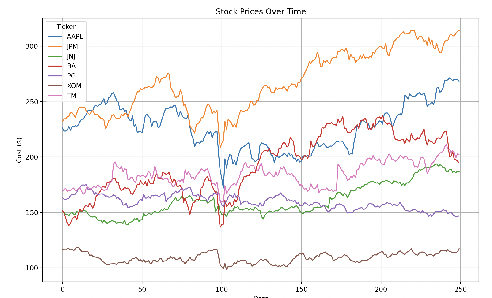

# Milestone 1
### Team: Jack Bray, Alex Shield, Getchell Gibbons
## Data Collection: 

## Related Works

## Data Analysis

1. Clean and Smooth Data

Yahoo finance has very complete data for all stocks that we are looking at becuase we are focused on either trends of categories of stocks or individual stocks of large componies with long lasting data. Additionally the data for all of these companies is reliable. We are smooting the data with a window of size twenty(subject to change) to reduce the impact of outliers. Lastly Yahoo finance structures data cleanly in a Dataframe with attributes of: Price at Open, Price at Close, Adjusted Price At Close, Volume Sold, additionally information of market volatility and expected value is available as well. 

2. Data Organization

We have organized our data into a few categories of Stocks {Tech, Finance, Healthcare, Industrials, Consumer, Energy, Golbal Stocks} and for Natural Resources we have categories of {Energy, Ores, Agriculture, Commodities}. 

3. Data Visualization

Some Data Stats for each category
| Ticker | Mean       | Std Dev    |
|:-------|------------:|-----------:|
| AAPL   | 226.966039 | 20.989261  |
| JPM    | 267.005001 | 27.902754  |
| JNJ    | 160.391375 | 14.836749  |
| BA     | 192.932320 | 27.535140  |
| PG     | 159.676269 |  6.571073  |
| XOM    | 109.148152 |  4.569703  |
| TM     | 184.317873 | 10.970219  |

Plot of a Stock from each category over one year

4. Data Analysis
The data has many small fluctuations and few large fluctuations. We are trying to predict the type of economy bull versus bear. 
(Curiousity) Would Fourier Anlalysis on the derivs yield anything. 

### Goal

### Model Choice

Possible Hidden States: 

Market Regimes: "Bullish" (trending up), "Bearish" (trending down), or "Sideways/Ranging" (consolidation or low activity).

Volatility Levels: "Calm/Low Volatility" and "Volatile/High Volatility" states.

Economic Cycles: Periods of "Recession" versus "Expansion".

Liquidity/Interest: States denoting high or low trading interest/volume
Possible Emmisions and Calculations of these emissions to use for Markov chain

Moving Average for data smoothing

Key metrics in Data:
Market Cap: The total value of a company's outstanding shares.

Volume: The number of shares traded during a period.

EPS: Earnings per share, a measure of profitability.

Beta: A measure of a stock's volatility relative to the market.

Ex-dividend date: The date by which a stock must be purchased to receive the next dividend payment.

One-year target estimate: An average of analyst price targets for the next year.

## Next Steps