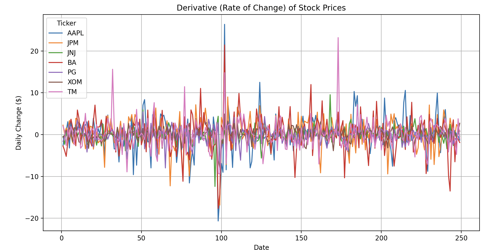

# Milestone 1
### Team: Jack Bray, Alex Shield, Getchell Gibbons
## Data Collection: 

## Relevant Related Sources
Within academic and industry papers there is a rich source of hidden markov model applications to detect market regimes and drive dynamic portfolio strategies. To better understand the functionalities of this model, we’ve surveyed a wide breadth of recent papers applying hidden markov models within the last 10 years. Each source is compiled and summarized with key findings and methodological notes. 

- Taljaard (2025), ESM Working Paper: This paper is a research document published by the European Stability Mechanism, an international finance institution vital to the financial stability of Euro area countries. Within this paper Taaljard proposes a fixed income portfolio optimization that first applies principal component analysis, a method to reduce data dimensionality, to yield curves and then fits a two state Gaussian HMM to the variance of the first principal component. The HMM flags for “high-volatility” vs “low volatility” regimes. The portfolios are rebalanced using data only from the current regime. In backtests, the strategy achieved VaR (Value at Risk) nearer the 3% target and delivered higher returns and lower volatility than a standard 5-year VaR approach. 
- Wang et al. (2020, J. Risk Financial Management): Written by an academic at Northwestern, Matthew Wang, and published in the journal of risk and financial management. Wang builds an HMM on S&P 500 ETF data to classify three market regimes (interpreted as bull, bear, neutral) based on daily returns and volatility. They then rotate among factor-based equity portfolios according to the detected regime (Fama-French, Momentum, value, etc). To evaluate the effectiveness of their model, Wang runs backtests from 2007-2020 showing that the HMM-switching strategy outperforms every individual factor model as it yields higher absolute and risk adjusted returns. 
- Kim et al. (2019, J. Risk Financial Management): Written by Eunchong Kim at QRAFT technologies and published in the Journal of Risk and Financial Management. Kim uses an HMM to detect latent phases of the global asset universe in a 15 year empirical study. The HMM dynamically shifts the portfolio by changing the weights based on events and noise. For example, increasing equity weight in rising markets and bond weight in falling markets. The strategy is tested by Kim through ETF portfolios and shows superior performance to static or momentum strategies. 
- Nystrup et al. (2017, Quantitative Finance): Written by Peter Nystrup and published in the Quantitative Finance Journal this paper develops a multi period mea-variance portfolio by implementing Model Predictive Control with HMM forecasts, essentially at each step, the model finds an optimized equilibrium that it uses to predict the systems behavior. Nystrup fits a HMM to stock returns to forecast regime dependent means and variances, and re-optimize portfolio weights at each step. This strategy realized higher returns and lower risk that the static buy and hold rule. 
- Fons et al. (2019, arXiv, Alliance Bernstein): Alliance Bernstein, a large asset manager, published this article on arXiv, a free and open source online access repository for scientific papers. Fons introduces a dynamic asset allocation system for smart-beta portfolios using HMM. They implemented an innovative approach through the addition of Feature-Saliency HMM, that performs feature selection during training. Fons et al. trained the HMM on factor-return time series, and built two different portfolios, one focused on return oriented investment vs risk focused portfolios. Across hundreds of factor combinations, the HMM consistently outperforms the static buy and hold and single regime benchmarks. Adding the Feature Saliency yielded improvements as HMM portfolios utilizing FSHMM enjoyed ~60% excess returns over market vs ~50% for full feature HMMs. 

Recap and Methodological Specifications: 
- To recap, most of the serious work in this space converges around a few non-negotiables. Gaussian Hidden Markov Models are the default. Two regimes dominate: bull vs. bear, or high vs. low vol. Going beyond that will likely cause overfitting. Within the Model, each state is characterized by distinct return and variance patterns, estimated via Expectation Maximization and decoded using the Viterbi algorithm to determine the most likely regime at each point in time.
- Feature inputs are usually daily or weekly log returns, sometimes supplemented with realized volatility, macro indices, or rolling correlations. The model is trained either on an expanding or rolling window to adapt to structural market changes. Once regimes are identified, allocations are adjusted accordingly: portfolios tilt toward risk assets during favorable regimes and shift into defensive assets or cash in adverse ones. 
Portfolio construction methods are fairly standardized. Many studies integrate regime‐specific mean-variance optimization or use fractional Kelly sizing based on regime‐conditioned expected returns and covariances. Risk management is embedded in the process. Position scaling or exposure limits are applied in high‐volatility regimes to control drawdown and Value‐at‐Risk.
- Across the literature, the outcomes are consistent: lower drawdowns, smoother return distributions, and higher Sharpe ratios relative to static benchmarks. In short, the prevailing structure Gaussian HMM with 2-3 latent regimes, return‐based features, rolling retraining, and regime‐aware rebalancing has become the standardized blueprint for dynamic asset allocation.
- Bench mark for success in papers: 20–30% reduction in drawdown vs. a static benchmark. Sharpe >1.5. Anything lower and it probably doesn’t hold up out-of-sample.

## Data Analysis

1. Clean and Smooth Data

Yahoo finance has very complete data for all stocks that we are looking at becuase we are focused on either trends of categories of stocks or individual stocks of large componies with long lasting data. Additionally the data for all of these companies is reliable. We are smooting the data with a window of size twenty(subject to change) to reduce the impact of outliers. Lastly Yahoo finance structures data cleanly in a Dataframe with attributes of: Price at Open, Price at Close, Adjusted Price At Close, Volume Sold, additionally information of market volatility and expected value is available as well. 

2. Data Organization

We have organized our data into a few categories of Stocks {Tech, Finance, Healthcare, Industrials, Consumer, Energy, Golbal Stocks} and for Natural Resources we have categories of {Energy, Ores, Agriculture, Commodities}. 

3. Data Visualization

Some Data Stats for each category
| Ticker | Mean       | Std Dev    |
|:-------|------------:|-----------:|
| AAPL   | 226.966039 | 20.989261  |
| JPM    | 267.005001 | 27.902754  |
| JNJ    | 160.391375 | 14.836749  |
| BA     | 192.932320 | 27.535140  |
| PG     | 159.676269 |  6.571073  |
| XOM    | 109.148152 |  4.569703  |
| TM     | 184.317873 | 10.970219  |

Plot of a Stock from each category over one year

4. Data Analysis
The data has many small fluctuations and few large fluctuations. We are trying to predict the type of economy bull versus bear. 
(Curiousity) Would Fourier Anlalysis on the derivs yield anything. 

## Next Steps

With the data retrieval successfully completed and the relevant literature synthesized, the next phase of our project will focus on developing a deeper understanding of the data and beginning to implement the modeling framework outlined in our research. This will involve further examining distributions of returns and volatilities, assessing autocorrelation structures, and identifying patterns or anomalies that may indicate underlying market regimes. Feature engineering will play a key role at this stage, as we plan to derive variables such as log returns, rolling volatilities, and possibly macroeconomic indicators that could enhance the regime detection process.

Once the dataset is fully understood and prepared, we will move to the initial modeling phase by implementing baseline Gaussian Hidden Markov Models (HMMs). Following the methodological blueprint established in the literature, we intend to test both two‐state and three‐state models to capture the most interpretable market dynamics, typically corresponding to “bull,” “bear,” and “neutral” regimes or “high” versus “low” volatility environments. The models will be estimated using the Expectation–Maximization (EM) algorithm and decoded using the Viterbi algorithm to obtain the most probable regime sequence. These inferred regimes will be visualized and qualitatively compared with known market events to assess plausibility.

Model evaluation will be conducted using a combination of statistical and performance-based metrics. We will assess model fit using log-likelihood, Bayesian Information Criterion (BIC), and Akaike Information Criterion (AIC), while also measuring the impact of regime-switching strategies on portfolio outcomes. Specifically, we will compare dynamic HMM-driven portfolios to static benchmarks based on return, volatility, drawdown reduction, and risk-adjusted performance (e.g., Sharpe ratio). The objective is to determine whether regime-aware rebalancing provides superior outcomes consistent with empirical results reported in the literature, such as smoother return distributions and 20–30% lower drawdowns.
