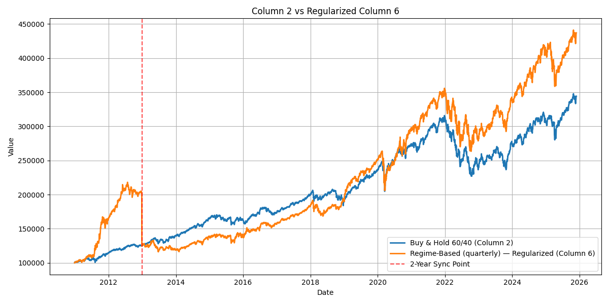

# Milestone 2

### Team: Jack Bray, Getchell Gibbons, Alex Shields

## Related Works:

## Data Understanding and Preparation

For the Data Understanding of the model we tried around 1000 differents sets of parameters

First: For features we had 5 different features and used 6 permutations of these seven features. 

| Feature          | Model 1 | Model 2 | Model 3 | Model 4 | Model 5 | Model 6 |
|-----------------|---------|---------|---------|---------|---------|---------|
| returns          | 1       | 1       | 1       | 1       | 1       | 1       |
| volatility       | 1       | 1       | 1       | 1       | 1       | 1       |
| rsi              | 0       | 1       | 0       | 1       | 0       | 1       |
| momentum         | 0       | 1       | 1       | 0       | 0       | 1       |
| market_breadth   | 0       | 0       | 0       | 0       | 1       | 1       |

### Features
Returns - The Returns of the stock

Volatility - How much the stock price fluctuates over time. 

RSI - The Relative Strength Index of the stocks. This metric is used to determine the momentum of stock movement. 

Momentum - A measure of speed and strength of price movement of a stock. 

Market Breadth - The overall Health and direction of the market. 

Outside of The chosen features for the model we also used parameters which were

### Other Parameters
n_stocks_range = [5, 7, 10, 15, 20]     
- Number of stocks to Include     

n_indices_range = [0, 3, 5]
- Number of Indices Included  

volatility_window_range = [10, 20, 30]    
- Number of Data points used to Calculated Valatility 
  
rsi_period_range = [14, 21] 
- Period fro calculating RSI   

momentum_period_range = [10, 20]       
- Period for Momentum Calculation       

train_ratio=0.8,
- The percentage of the data that is used for training and the rest is used for testing.

## Data Analysis Steps

This graph shows the annual percent returns of the model over 15 years. Over the course of 15 years the best performing model was our Regime based model with quarterly adjustments. It had the best performance in 8/15 years. Additionally it never performed significantly worse than the then best model. The worst year for our model was either 2010 or 2013 where it performed near average over all models tested. Therefore in the worst it performs average among model which is good for risk mitigation.

This graph depicts the cumulataive returns of our model with different rebalance frequency vs standard investment strategies. Out model with regular rebalances of the regime that od not happen to frequently is the best performing model over time. This graph may not be fully indicative of a better model. This is because it only significantly differs from the literature models in the first few years where there is a large increase in overall value. Then percentage wise it seems to follow a similar pattern ot the 60-40 buy and hold model. 

This graph regularizes the regime if they had the same vaklue two years after the model started. This is due to the large spike in the model in the first two years and the relatively consistent shape with the normal model afterwards. As this shows the model slightly out performs the base mdoel in the long term but does worse at than the market at time outside of the initial spike. 

