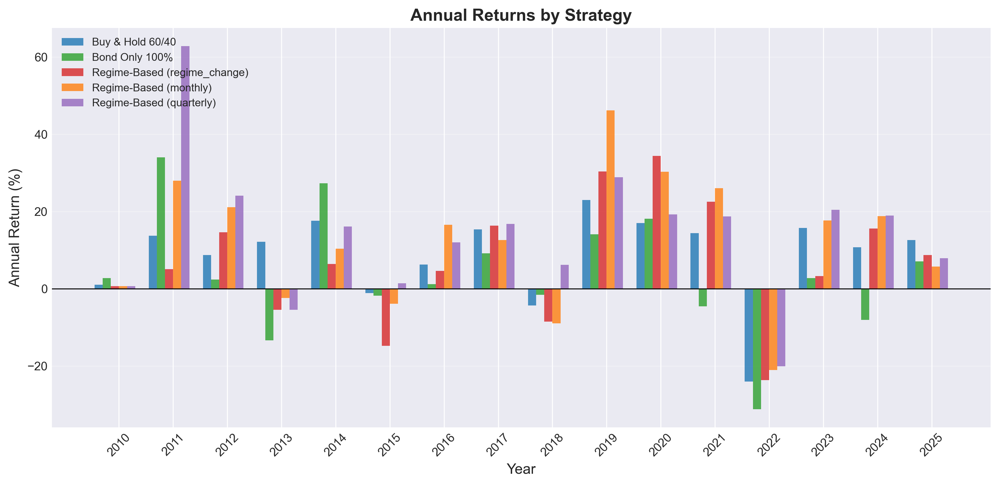
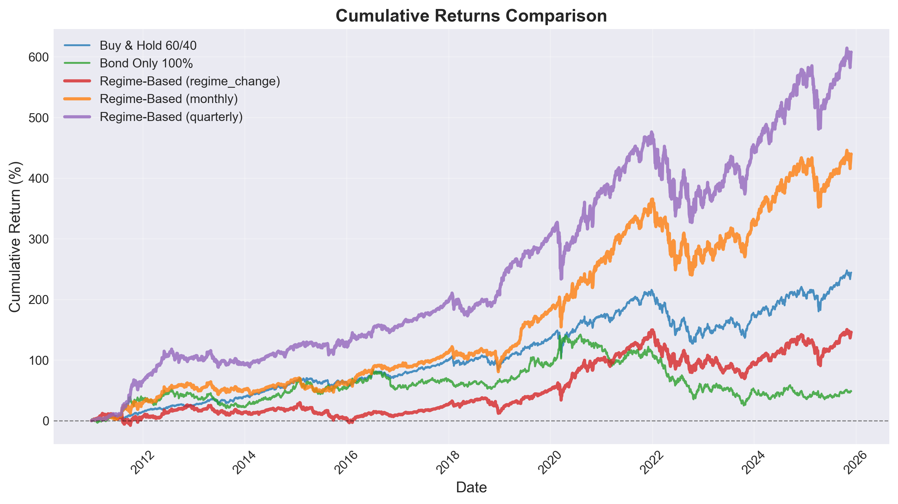
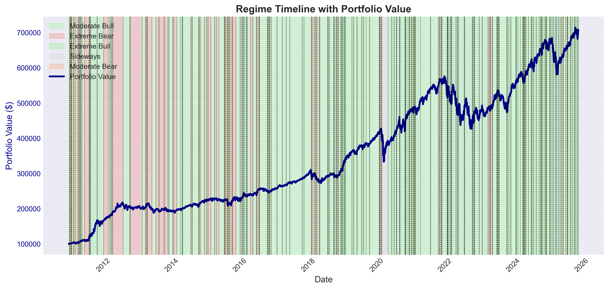
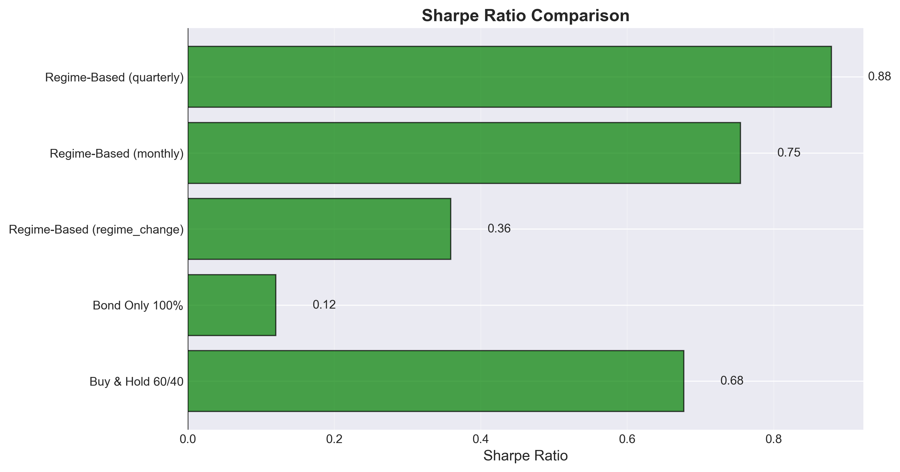

# Milestone 2

### Team: Jack Bray, Getchell Gibbons, Alex Shields

## Related Works:

## Data Understanding and Preparation

## Data Analysis Steps

This graph shows the annual percent returns of the model over 15 years. Over the course of 15 years the best performing model was our Regime based model with quarterly adjustments. It had the best performance in 8/15 years. Additionally it never performed significantly worse than the then best model. The worst year for our model was either 2010 or 2013 where it performed near average over all models tested. Therefore in the worst it performs average among model which is good for risk mitigation.

This graph depicts the cumulataive returns of our model with different rebalance frequency vs standard investment strategies. Out model with regular rebalances of the regime that od not happen to frequently is the best performing model over time. This graph may not be fully indicative of a better model. This is because it only significantly differs from the literature models in the first few years where there is a large increase in overall value. Then percentage wise it seems to follow a similar pattern ot the 60-40 buy and hold model. 

